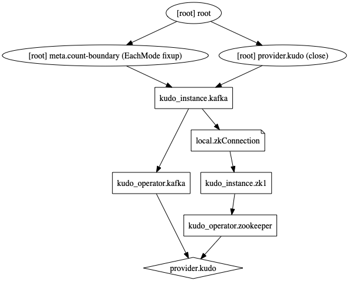

# KUDO Terraform Provider, Part 1

[KUDO](https://kudo.dev) is rolling out new and amazing features every month, but there still are plenty of features that are needed to facilitate usage for production workflows.  This KUDO Terraform provider looks to provide a solution for managing interconnected `Instances` and passing information from one Instance to another in a manner that allows for seemless upgrades.

## Currently

KUDO has the ability to provide `Instance`s specific values to the application through the use of `PARAMETERS`.  These parameters allow for `strings` to be used as inputs to the template rendering built into KUDO.  More about the use of Parameters can be found [Here](https://kudo.dev/docs/developing-operators/parameters.html).

The following example shows more explicitly how parameters are set and managed in a multi-`Instance` environment. In this simple example, supposed we want to deploy a [Kafka](https://github.com/kudobuilder/operators/tree/master/repository/kafka) cluster backed by a [Zookeeper](https://github.com/kudobuilder/operators/tree/master/repository/zookeeper) cluster defined with the following relationship:   Once complete, applying the following objects to the Kubernetes cluster represent that relationship:

```yaml
apiVersion: kudo.dev/v1beta1
kind: Instance
metadata:
    name: zook
    namespace: default
spec:
    operatorVersion:
        name: zookeeper-0.3.0
        namespace: default
    parameters:
        NODE_COUNT: "3"
---
apiVersion: kudo.dev/v1beta1
kind: Instance
metadata:
    name: pipes
    namespace: default
spec:
    operatorVersion:
        name: kafka-1.2.0
        namespace: default
    parameters:
        ZOOKEEPER_URI: zook-zookeeper-0.zook-hs:2181,zook-zookeeper-1.zook-hs:2181,zook-zookeeper-2.zook-hs:2181
```

The `ZOOKEEPER_URI` value was hand calculated with knowledge of what the `NODE_COUNT` value was set to in the Zookeeper `Instance`. 

Before applying these objects, the cluster would need to be configured 
Before applying this example to a cluster, the KUDO CLI is needed to [install KUDO](https://kudo.dev/docs/#getting-started) and  [install the `Operators`](https://kudo.dev/docs/#deploy-your-first-operator) needed. 

 During the initial rollout of these two instances, the KUDO controller will attempt to deploy both at the same time.  This will have the effect of causing Kafka to error and restart pods multiple times while they fail to connect to the Zookeeper cluster before it's successfully deployed. After the inital deployment, suppose, during our use of Kafka, we determine we need to scale out our Zookeeper instance and we patch Zookeeper to the following:

```yaml
apiVersion: kudo.dev/v1beta1
kind: Instance
metadata:
    name: zook
    namespace: default
spec:
    operatorVersion:
        name: zookeeper-0.3.0
        namespace: default
    parameters:
        NODE_COUNT: "5"
```

This update would not be seen by the `Kafka` instance, since the new pods that get deployed would not be part of the connection string that `Kafka` was configured with.  The application operator would need to also patch the `Kafka` instance and update the connection string to properly leverage the improved Zookeeper backend:

```yaml
apiVersion: kudo.dev/v1beta1
kind: Instance
metadata:
    name: pipes
    namespace: default
spec:
    operatorVersion:
        name: kafka-1.2.0
        namespace: default
    parameters:
        ZOOKEEPER_URI: zook-zookeeper-0.zook-hs:2181,zook-zookeeper-1.zook-hs:2181,zook-zookeeper-2.zook-hs:2181,zook-zookeeper-3.zook-hs:2181,zook-zookeeper-4.zook-hs:2181
```


This example shows several limitations with managing workloads:

1. When deploying dependent `Instances`, there's no mechanism to wait for one to get healthy before deploying the downstream `Instance`.
2. Install/Updating one instance does not propegate its changes to downstream `Instances`


### Terraform

[Terraform](https://www.terraform.io/) provides a language to define the architecture of the applications (or infrastructure) being deployed in such a way that dependencies are clearly defined by created a [Dependency Graph](https://www.terraform.io/docs/internals/graph.html).  This clear graph allows Terraform to orchestrate the deployment of objects in a way that ensures all dependencies of an object are ready and healthy before proceeding. The KUDO provider uses the active [Plan](https://kudo.dev/docs/developing-operators/plans.html) that was run for the instance to track its status.  When the active plan gets marked as complete, the provider knows the object is healthy and can proceed to the next object.

The KUDO provider currently supports two types of resources: `kudo_operator` and `kudo_instance`.  Future support for `kudo_repositories` is planned.


### KUDO Terraform Provider

In order for these two instances to be tied together effectively, we need the ability to provide references another `Instances`'s paramaters, our its current state inside the cluster after becoming healthy.  As described in the [Terraform Docs](https://www.terraform.io/docs/configuration/resources.html), the resources defined in terraform allow for referencing both user provided values as well as `computed` values that are only calculated by the provider after installation/updating.  

The KUDO Provider provides a list of all parameter values (both default and instance specific), as well as a list of all `pods`, `deployments`, `services`, `statefulsets` and `pvcs`.  These computed values can be used to generate connection strings for other `Instance`s to use.

In addition to the generation of these outputs from an Instance for consumption by another Instance, Terraform will use the Dependency graph to cascade changes throughout your environment when parameter values for an instance get updated.  As such, the application operator will not have to re-configure the `Kafka` `Instance` to pickup the new connection string once the Zookeeper instance is updated.

### Example Revisited

Revisiting our initial example, rather than having to manually install KUDO and our operators, we can use Terraform to define what we'd like available on our cluster.  These objects are captured in [main.tf](main.tf), but we describe the various objects here.


#### KUDO Installation

Instead of installing  KUDO via the CLI, the definition of the KUDO provider in `main.tf` ensures that KUDO is installed:

```hc2
//Ensure's KUDO is installed on your cluster
provider "kudo" {
    # Path to your local kubeconfig
    config_path = "~/.kube/config"
    # Tell the provider to load this config file
    load_config_file = true
    # Version of KUDO to install
    kudo_version = "0.10.0"
}
```

#### Operator Installation

Installing each `Operator` requires the defintiion of a `kudo_operator` resource specifying the name of the Operator.  Other configurations are available for specifying a specific `operator_version` or `repo` to install from.  Installing our Kafka and Zookeeper Operators requires the addition of these two resources in `main.tf`

```hc2
// Installs the most recent Zookeeper Operator
resource "kudo_operator" "zookeeper" {
    operator_name = "zookeeper"
}

// Installs the most recent Kafka Operator
resource "kudo_operator" "kafka" {
    operator_name = "kafka"
}
```


### KUDO Instance

Similiarly installing the `Instances` can then be defined via the `kudo_instance` resource.

```hc2
resource "kudo_instance" "zk1" {
    name = "zook"
    parameters = {
        "NODE_COUNT": 3,
    }
    operator_version_name = kudo_operator.zookeeper.object_name
}
```

defines the Zookeeper instance in our example with a name of `zook` and a parameter `NODE_COUNT` set to 3.  Note the `operator_version_name` that this instances is built from is referenced directly from the `kudo_operator.zookeeper` object.  This ensures that the `Operator` is installed before we try and create the `Zookeeper` instance. 

The `kudo_instance` resource has several computed values that can be used as inputs to future resources.  The `kudo_instance` provides a list of all `pods`, `deployments`, `services`, `statefulsets`, `pvcs` and `configmaps` that are owned by the instance, as well as all `output_parameters` which combine the default `parameters` defined in the `OperatorVersion` with the local overrides for the `Instance`.  As a result, we can define the following [local](https://www.terraform.io/docs/configuration/locals.html) value, which provides a connection string to the Zookeeper instance:

```hc2
locals {
    zkConnection = join(",",formatlist("%s.${kudo_instance.zk1.name}-hs:${kudo_instance.zk1.output_parameters.CLIENT_PORT}", kudo_instance.zk1.pods[*]))
}
```

This local value can now be used as an input to Kafka's parameter:

```hc2
resource "kudo_instance" "kafka" {
    name = "pipes"
    parameters = {
        "ZOOKEEPER_URI": local.zkConnection
    }
    operator_version_name = kudo_operator.kafka.object_name
}
```

Due to the relationship of the Terraform objects, `kudo_instance.zk1` is needed before we can deploy `kudo_instance.kafka` since the output of the former is used as an input to the latter.  This relationship is captured in the dependency graph which shows the order Terraform will create and update objects in our environment.  Note that the earlier objects are at the bottom and Terraform moves up the graph, ensuring each parent node is healthy before starting a child node.



## Terraform In Action!

Now that we've described the `main.tf` file that defines our application stack, we can use it to deploy our application to a Kubernetes cluster.  This example assumes you have your kubeconfig set to a Kubernetes cluster.  If you don't have one available, you can deploy Minikube in the next section.  If you already have one, feel free to skip this step:

### Minikube

[Minikube](https://kubernetes.io/docs/setup/learning-environment/minikube/) is a tool that makes it easy to run Kubernetes locally.  If needed, [Install Minkube](https://kubernetes.io/docs/tasks/tools/install-minikube/) and create a cluster that has at least 5 CPUs:

```bash
minikube config set memory 12000
minikube config set cpus 5
minikube start
```

### Install the KUDO provider

Clone down the [KUDO Provider Repo](https://github.com/runyontr/terraform-provider-kudo) and use the Makefile to install the KUDO provider binary into `~/.terraform.d/plugins`.  This provider was developed with Go version 1.13.5.

```bash
git clone https://github.com/runyontr/terraform-provider-kudo
cd terraform-provider-kudo
make build
```

### Planning

Terraform can provide a summary of the differences between your `main.tf` file and the local Kubernetes cluster. 

```bash
$ terraform plan
Refreshing Terraform state in-memory prior to plan...
The refreshed state will be used to calculate this plan, but will not be
persisted to local or remote state storage.


------------------------------------------------------------------------

An execution plan has been generated and is shown below.
Resource actions are indicated with the following symbols:
  + create

Terraform will perform the following actions:

  # kudo_instance.kafka will be created
  + resource "kudo_instance" "kafka" {
      + cleanup_pvcs               = true
      + configmaps                 = (known after apply)
      + deployments                = (known after apply)
      + id                         = (known after apply)
      + name                       = "pipes"
      + namespace                  = "default"
      + operator_version_name      = (known after apply)
      + operator_version_namespace = "default"
      + output_parameters          = (known after apply)
      + parameters                 = (known after apply)
      + pods                       = (known after apply)
      + pvcs                       = (known after apply)
      + services                   = (known after apply)
      + statefulsets               = (known after apply)
    }

  # kudo_instance.zk1 will be created
  + resource "kudo_instance" "zk1" {
      + cleanup_pvcs               = true
      + configmaps                 = (known after apply)
      + deployments                = (known after apply)
      + id                         = (known after apply)
      + name                       = "zook"
      + namespace                  = "default"
      + operator_version_name      = (known after apply)
      + operator_version_namespace = "default"
      + output_parameters          = (known after apply)
      + parameters                 = {
          + "NODE_COUNT" = "5"
        }
      + pods                       = (known after apply)
      + pvcs                       = (known after apply)
      + services                   = (known after apply)
      + statefulsets               = (known after apply)
    }

  # kudo_operator.kafka will be created
  + resource "kudo_operator" "kafka" {
      + id                 = (known after apply)
      + object_name        = (known after apply)
      + operator_name      = "kafka"
      + operator_namespace = "default"
      + operator_version   = (known after apply)
      + repo               = (known after apply)
      + skip_instance      = true
    }

  # kudo_operator.zookeeper will be created
  + resource "kudo_operator" "zookeeper" {
      + id                 = (known after apply)
      + object_name        = (known after apply)
      + operator_name      = "zookeeper"
      + operator_namespace = "default"
      + operator_version   = (known after apply)
      + repo               = (known after apply)
      + skip_instance      = true
    }

Plan: 4 to add, 0 to change, 0 to destroy.

------------------------------------------------------------------------

Note: You didn't specify an "-out" parameter to save this plan, so Terraform
can't guarantee that exactly these actions will be performed if
"terraform apply" is subsequently run.
```

## Make the change

Now that we can see and verify the 4 objects we need to create to deploy our Kafka cluster, we can apply those changes with

```bash
terraform apply
kudo_operator.kafka: Refreshing state... [id=default-kafka-1.2.0]
kudo_operator.zookeeper: Refreshing state... [id=default-zookeeper-0.3.0]

An execution plan has been generated and is shown below.
Resource actions are indicated with the following symbols:
  + create

Terraform will perform the following actions:

  # kudo_instance.kafka will be created
  + resource "kudo_instance" "kafka" {
      + cleanup_pvcs               = true
      + configmaps                 = (known after apply)
      + deployments                = (known after apply)
      + id                         = (known after apply)
      + name                       = "pipes"
      + namespace                  = "default"
      + operator_version_name      = (known after apply)
      + operator_version_namespace = "default"
      + output_parameters          = (known after apply)
      + parameters                 = (known after apply)
      + pods                       = (known after apply)
      + pvcs                       = (known after apply)
      + services                   = (known after apply)
      + statefulsets               = (known after apply)
    }

  # kudo_instance.zk1 will be created
  + resource "kudo_instance" "zk1" {
      + cleanup_pvcs               = true
      + configmaps                 = (known after apply)
      + deployments                = (known after apply)
      + id                         = (known after apply)
      + name                       = "zook"
      + namespace                  = "default"
      + operator_version_name      = (known after apply)
      + operator_version_namespace = "default"
      + output_parameters          = (known after apply)
      + parameters                 = {
          + "NODE_COUNT" = "5"
        }
      + pods                       = (known after apply)
      + pvcs                       = (known after apply)
      + services                   = (known after apply)
      + statefulsets               = (known after apply)
    }

  # kudo_operator.kafka will be created
  + resource "kudo_operator" "kafka" {
      + id                 = (known after apply)
      + object_name        = (known after apply)
      + operator_name      = "kafka"
      + operator_namespace = "default"
      + operator_version   = (known after apply)
      + repo               = (known after apply)
      + skip_instance      = true
    }

  # kudo_operator.zookeeper will be created
  + resource "kudo_operator" "zookeeper" {
      + id                 = (known after apply)
      + object_name        = (known after apply)
      + operator_name      = "zookeeper"
      + operator_namespace = "default"
      + operator_version   = (known after apply)
      + repo               = (known after apply)
      + skip_instance      = true
    }

Plan: 4 to add, 0 to change, 0 to destroy.

Do you want to perform these actions?
  Terraform will perform the actions described above.
  Only 'yes' will be accepted to approve.

  Enter a value: yes

kudo_operator.zookeeper: Creating...
kudo_operator.kafka: Creating...
kudo_operator.zookeeper: Creation complete after 0s [id=default-zookeeper-0.3.0]
kudo_instance.zk1: Creating...
kudo_operator.kafka: Creation complete after 0s [id=default-kafka-1.2.0]
kudo_instance.zk1: Still creating... [10s elapsed]
kudo_instance.zk1: Still creating... [20s elapsed]
kudo_instance.zk1: Still creating... [30s elapsed]
kudo_instance.zk1: Still creating... [40s elapsed]
kudo_instance.zk1: Still creating... [50s elapsed]
kudo_instance.zk1: Still creating... [1m0s elapsed]
kudo_instance.zk1: Creation complete after 1m9s [id=default_zook]
kudo_instance.kafka: Creating...
kudo_instance.kafka: Still creating... [10s elapsed]
kudo_instance.kafka: Still creating... [20s elapsed]
kudo_instance.kafka: Still creating... [30s elapsed]
kudo_instance.kafka: Still creating... [40s elapsed]
kudo_instance.kafka: Still creating... [50s elapsed]
kudo_instance.kafka: Creation complete after 54s [id=default_pipes]

Apply complete! Resources: 4 added, 0 changed, 0 destroyed.
```

Note that the kafka instance was created after the zookeeper instance's creation was complete.  This was ensured by Terraform's dependency graph. Looking at the kafka instance we can see the correct pods were used for the connection string:

```bash
$ kubectl get instances pipes -o jsonpath="{ .spec.parameters.ZOOKEEPER_URI }"
zook-zookeeper-0.zook-hs:2181,zook-zookeeper-1.zook-hs:2181,zook-zookeeper-2.zook-hs:2181
```

## Rolling out updates

Terraform uses the dependency graph for updating the environment as well.  If the application operator decided to increase the Zookeeper cluster to 5 nodes by changing the resource as follows:

```hc2
resource "kudo_instance" "zk1" {
    name = "zook"
    parameters = {
        "NODE_COUNT": 5,
    }
    operator_version_name = kudo_operator.zookeeper.object_name
}
```

We would see two objects being updated as a result:

```bash
$ terraform plan
Refreshing Terraform state in-memory prior to plan...
The refreshed state will be used to calculate this plan, but will not be
persisted to local or remote state storage.

kudo_operator.kafka: Refreshing state... [id=default-kafka-1.2.0]
kudo_operator.zookeeper: Refreshing state... [id=default-zookeeper-0.3.0]
kudo_instance.zk1: Refreshing state... [id=default_zook]
kudo_instance.kafka: Refreshing state... [id=default_pipes]

------------------------------------------------------------------------

An execution plan has been generated and is shown below.
Resource actions are indicated with the following symbols:
  ~ update in-place

Terraform will perform the following actions:

  # kudo_instance.kafka will be updated in-place
  ~ resource "kudo_instance" "kafka" {
        cleanup_pvcs               = true
      ~ configmaps                 = [
          - "pipes-bootstrap",
          - "pipes-enable-tls",
          - "pipes-health-check-script",
          - "pipes-jaas-config",
          - "pipes-krb5-config",
          - "pipes-metrics-config",
          - "pipes-serverproperties",
        ] -> (known after apply)
      ~ deployments                = [] -> (known after apply)
        id                         = "default_pipes"
        name                       = "pipes"
        namespace                  = "default"
        operator_version_name      = "kafka-1.2.0"
        operator_version_namespace = "default"
      ~ output_parameters          = {
          - "ADD_SERVICE_MONITOR"                                         = "false"
          - "AUTHORIZATION_ALLOW_EVERYONE_IF_NO_ACL_FOUND"                = "false"
          - "AUTHORIZATION_ENABLED"                                       = "false"
          - "AUTHORIZATION_SUPER_USERS"                                   = ""
          - "AUTO_CREATE_TOPICS_ENABLE"                                   = "true"
          - "AUTO_LEADER_REBALANCE_ENABLE"                                = "true"
          - "BACKGROUND_THREADS"                                          = "10"
          - "BROKER_COUNT"                                                = "3"
          - "BROKER_CPUS"                                                 = "500m"
          - "BROKER_CPUS_LIMIT"                                           = "2000m"
          - "BROKER_MEM"                                                  = "2048Mi"
          - "BROKER_MEM_LIMIT"                                            = "4096Mi"
          - "BROKER_PORT"                                                 = "9093"
          - "BROKER_PORT_TLS"                                             = "9095"
          - "CLIENT_PORT"                                                 = "9092"
          - "CLIENT_PORT_ENABLED"                                         = "true"
          - "COMPRESSION_TYPE"                                            = "producer"
          - "CONNECTIONS_MAX_IDLE_MS"                                     = "600000"
          - "CONTROLLED_SHUTDOWN_ENABLE"                                  = "true"
          - "CONTROLLED_SHUTDOWN_MAX_RETRIES"                             = "3"
          - "CONTROLLED_SHUTDOWN_RETRY_BACKOFF_MS"                        = "5000"
          - "CONTROLLER_SOCKET_TIMEOUT_MS"                                = "30000"
          - "DEFAULT_REPLICATION_FACTOR"                                  = "1"
          - "DELETE_RECORDS_PURGATORY_PURGE_INTERVAL_REQUESTS"            = "1"
          - "DELETE_TOPIC_ENABLE"                                         = "false"
          - "DISK_SIZE"                                                   = "5Gi"
          - "EXTERNAL_ADVERTISED_LISTENER"                                = "false"
          - "EXTERNAL_ADVERTISED_LISTENER_PORT"                           = "9097"
          - "EXTERNAL_ADVERTISED_LISTENER_TYPE"                           = "NodePort"
          - "EXTERNAL_NODE_PORT"                                          = "30902"
          - "FETCH_PURGATORY_PURGE_INTERVAL_REQUESTS"                     = "1000"
          - "GROUP_INITIAL_REBALANCE_DELAY_MS"                            = "3000"
          - "GROUP_MAX_SESSION_TIMEOUT_MS"                                = "300000"
          - "GROUP_MIN_SESSION_TIMEOUT_MS"                                = "6000"
          - "INTER_BROKER_PROTOCOL_VERSION"                               = "2.1"
          - "KAFKA_NODE_EXPORTER_PORT"                                    = "9096"
          - "KERBEROS_DEBUG"                                              = "false"
          - "KERBEROS_ENABLED"                                            = "false"
          - "KERBEROS_ENABLED_FOR_ZOOKEEPER"                              = "false"
          - "KERBEROS_KDC_HOSTNAME"                                       = "kdc-service"
          - "KERBEROS_KDC_PORT"                                           = "2500"
          - "KERBEROS_KEYTAB_SECRET"                                      = "base64-kafka-keytab-secret"
          - "KERBEROS_PRIMARY"                                            = "kafka"
          - "KERBEROS_REALM"                                              = "LOCAL"
          - "KERBEROS_USE_TCP"                                            = "false"
          - "LEADER_IMBALANCE_CHECK_INTERVAL_SECONDS"                     = "300"
          - "LEADER_IMBALANCE_PER_BROKER_PERCENTAGE"                      = "10"
          - "LIVENESS_FAILURE_THRESHOLD"                                  = "3"
          - "LIVENESS_INITIAL_DELAY_SECONDS"                              = "30"
          - "LIVENESS_KERBEROS_PRIMARY"                                   = "livenessProbe"
          - "LIVENESS_METHOD"                                             = "PORT"
          - "LIVENESS_PERIOD_SECONDS"                                     = "30"
          - "LIVENESS_TIMEOUT_SECONDS"                                    = "30"
          - "LIVENESS_TOPIC_PREFIX"                                       = "KafkaLivenessTopic"
          - "LOG_CLEANER_BACKOFF_MS"                                      = "15000"
          - "LOG_CLEANER_DEDUPE_BUFFER_SIZE"                              = "134217728"
          - "LOG_CLEANER_DELETE_RETENTION_MS"                             = "86400000"
          - "LOG_CLEANER_ENABLE"                                          = "true"
          - "LOG_CLEANER_IO_BUFFER_LOAD_FACTOR"                           = "0.9"
          - "LOG_CLEANER_IO_BUFFER_SIZE"                                  = "524288"
          - "LOG_CLEANER_IO_MAX_BYTES_PER_SECOND"                         = "1.7976931348623157e+308"
          - "LOG_CLEANER_MIN_CLEANABLE_RATIO"                             = "0.5"
          - "LOG_CLEANER_MIN_COMPACTION_LAG_MS"                           = "0"
          - "LOG_CLEANER_THREADS"                                         = "1"
          - "LOG_CLEANUP_POLICY"                                          = "delete"
          - "LOG_FLUSH_INTERVAL_MESSAGES"                                 = "9223372036854775807"
          - "LOG_FLUSH_INTERVAL_MS"                                       = "9223372036854775807"
          - "LOG_FLUSH_OFFSET_CHECKPOINT_INTERVAL_MS"                     = "60000"
          - "LOG_FLUSH_SCHEDULER_INTERVAL_MS"                             = "9223372036854775807"
          - "LOG_FLUSH_START_OFFSET_CHECKPOINT_INTERVAL_MS"               = "60000"
          - "LOG_INDEX_INTERVAL_BYTES"                                    = "4096"
          - "LOG_INDEX_SIZE_MAX_BYTES"                                    = "10485760"
          - "LOG_MESSAGE_FORMAT_VERSION"                                  = "2.1"
          - "LOG_PREALLOCATE"                                             = "false"
          - "LOG_RETENTION_BYTES"                                         = "-1"
          - "LOG_RETENTION_CHECK_INTERVAL_MS"                             = "300000"
          - "LOG_RETENTION_HOURS"                                         = "168"
          - "LOG_ROLL_HOURS"                                              = "168"
          - "LOG_ROLL_JITTER_HOURS"                                       = "0"
          - "LOG_SEGMENT_BYTES"                                           = "1073741824"
          - "LOG_SEGMENT_DELETE_DELAY_MS"                                 = "60000"
          - "MAX_CONNECTIONS_PER_IP"                                      = "2147483647"
          - "MAX_CONNECTIONS_PER_IP_OVERRIDES"                            = ""
          - "MESSAGE_MAX_BYTES"                                           = "1000012"
          - "METRICS_ENABLED"                                             = "true"
          - "METRICS_NUM_SAMPLES"                                         = "2"
          - "METRICS_PORT"                                                = "9094"
          - "METRICS_SAMPLE_WINDOW_MS"                                    = "30000"
          - "METRIC_REPORTERS"                                            = ""
          - "MIN_INSYNC_REPLICAS"                                         = "1"
          - "MIRROR_MAKER_ABORT_ON_SEND_FAILURE"                          = "true"
          - "MIRROR_MAKER_CPUS"                                           = "100m"
          - "MIRROR_MAKER_CPUS_LIMIT"                                     = "100m"
          - "MIRROR_MAKER_ENABLED"                                        = "false"
          - "MIRROR_MAKER_EXTERNAL_BOOTSTRAP_SERVERS"                     = ""
          - "MIRROR_MAKER_EXTERNAL_CLUSTER_TYPE"                          = "SOURCE"
          - "MIRROR_MAKER_MEM"                                            = "512Mi"
          - "MIRROR_MAKER_MEM_LIMIT"                                      = "512Mi"
          - "MIRROR_MAKER_NUM_STREAMS"                                    = "1"
          - "MIRROR_MAKER_OFFSET_COMMIT_INTERVAL"                         = "60000"
          - "MIRROR_MAKER_REPLICA_COUNT"                                  = "1"
          - "MIRROR_MAKER_TOPIC_WHITELIST"                                = ".*"
          - "NUM_IO_THREADS"                                              = "8"
          - "NUM_NETWORK_THREADS"                                         = "3"
          - "NUM_PARTITIONS"                                              = "3"
          - "NUM_RECOVERY_THREADS_PER_DATA_DIR"                           = "1"
          - "NUM_REPLICA_FETCHERS"                                        = "1"
          - "OFFSETS_COMMIT_REQUIRED_ACKS"                                = "-1"
          - "OFFSETS_COMMIT_TIMEOUT_MS"                                   = "5000"
          - "OFFSETS_LOAD_BUFFER_SIZE"                                    = "5242880"
          - "OFFSETS_RETENTION_CHECK_INTERVAL_MS"                         = "600000"
          - "OFFSETS_RETENTION_MINUTES"                                   = "1440"
          - "OFFSETS_TOPIC_COMPRESSION_CODEC"                             = "0"
          - "OFFSETS_TOPIC_NUM_PARTITIONS"                                = "50"
          - "OFFSETS_TOPIC_REPLICATION_FACTOR"                            = "3"
          - "OFFSETS_TOPIC_SEGMENT_BYTES"                                 = "104857600"
          - "OFFSET_METADATA_MAX_BYTES"                                   = "4096"
          - "PERSISTENT_STORAGE"                                          = "true"
          - "PRODUCER_PURGATORY_PURGE_INTERVAL_REQUESTS"                  = "1000"
          - "QUEUED_MAX_REQUESTS"                                         = "500"
          - "QUEUED_MAX_REQUEST_BYTES"                                    = "-1"
          - "QUOTA_CONSUMER_DEFAULT"                                      = "9223372036854775807"
          - "QUOTA_PRODUCER_DEFAULT"                                      = "9223372036854775807"
          - "QUOTA_WINDOW_NUM"                                            = "11"
          - "QUOTA_WINDOW_SIZE_SECONDS"                                   = "1"
          - "READINESS_FAILURE_THRESHOLD"                                 = "3"
          - "READINESS_INITIAL_DELAY_SECONDS"                             = "10"
          - "READINESS_PERIOD_SECONDS"                                    = "10"
          - "READINESS_SUCCESS_THRESHOLD"                                 = "1"
          - "READINESS_TIMEOUT_SECONDS"                                   = "30"
          - "REPLICATION_QUOTA_WINDOW_NUM"                                = "11"
          - "REPLICATION_QUOTA_WINDOW_SIZE_SECONDS"                       = "1"
          - "REPLICA_FETCH_BACKOFF_MS"                                    = "1000"
          - "REPLICA_FETCH_MAX_BYTES"                                     = "1048576"
          - "REPLICA_FETCH_MIN_BYTES"                                     = "1"
          - "REPLICA_FETCH_RESPONSE_MAX_BYTES"                            = "10485760"
          - "REPLICA_FETCH_WAIT_MAX_MS"                                   = "500"
          - "REPLICA_HIGH_WATERMARK_CHECKPOINT_INTERVAL_MS"               = "5000"
          - "REPLICA_LAG_TIME_MAX_MS"                                     = "10000"
          - "REPLICA_SOCKET_RECEIVE_BUFFER_BYTES"                         = "65536"
          - "REPLICA_SOCKET_TIMEOUT_MS"                                   = "30000"
          - "REQUEST_TIMEOUT_MS"                                          = "30000"
          - "RESERVED_BROKER_MAX_ID"                                      = "1000"
          - "RUN_USER_WORKLOAD"                                           = "false"
          - "SOCKET_RECEIVE_BUFFER_BYTES"                                 = "102400"
          - "SOCKET_REQUEST_MAX_BYTES"                                    = "104857600"
          - "SOCKET_SEND_BUFFER_BYTES"                                    = "102400"
          - "SSL_AUTHENTICATION_ENABLED"                                  = "false"
          - "SSL_ENDPOINT_IDENTIFICATION_ALGORITHM"                       = "HTTPS"
          - "TLS_SECRET_NAME"                                             = "kafka-tls"
          - "TRANSACTIONAL_ID_EXPIRATION_MS"                              = "604800000"
          - "TRANSACTION_ABORT_TIMED_OUT_TRANSACTION_CLEANUP_INTERVAL_MS" = "60000"
          - "TRANSACTION_MAX_TIMEOUT_MS"                                  = "900000"
          - "TRANSACTION_REMOVE_EXPIRED_TRANSACTION_CLEANUP_INTERVAL_MS"  = "3600000"
          - "TRANSACTION_STATE_LOG_LOAD_BUFFER_SIZE"                      = "5242880"
          - "TRANSACTION_STATE_LOG_MIN_ISR"                               = "2"
          - "TRANSACTION_STATE_LOG_NUM_PARTITIONS"                        = "50"
          - "TRANSACTION_STATE_LOG_REPLICATION_FACTOR"                    = "3"
          - "TRANSACTION_STATE_LOG_SEGMENT_BYTES"                         = "104857600"
          - "TRANSPORT_ENCRYPTION_ALLOW_PLAINTEXT"                        = "false"
          - "TRANSPORT_ENCRYPTION_CIPHERS"                                = "TLS_RSA_WITH_AES_128_GCM_SHA256,TLS_RSA_WITH_AES_128_CBC_SHA256,TLS_RSA_WITH_AES_256_GCM_SHA384,TLS_RSA_WITH_AES_256_CBC_SHA256,TLS_DHE_RSA_WITH_AES_128_GCM_SHA256,TLS_DHE_RSA_WITH_AES_128_CBC_SHA256,TLS_DHE_RSA_WITH_AES_256_GCM_SHA384,TLS_DHE_RSA_WITH_AES_256_CBC_SHA256,TLS_ECDHE_RSA_WITH_AES_128_GCM_SHA256,TLS_ECDHE_RSA_WITH_AES_128_CBC_SHA256,TLS_ECDHE_RSA_WITH_AES_256_GCM_SHA384,TLS_ECDHE_RSA_WITH_AES_256_CBC_SHA384"
          - "TRANSPORT_ENCRYPTION_ENABLED"                                = "false"
          - "UNCLEAN_LEADER_ELECTION_ENABLE"                              = "false"
          - "ZOOKEEPER_SESSION_TIMEOUT_MS"                                = "6000"
          - "ZOOKEEPER_SYNC_TIME_MS"                                      = "2000"
          - "ZOOKEEPER_URI"                                               = "zook-zookeeper-0.zook-hs:2181,zook-zookeeper-1.zook-hs:2181,zook-zookeeper-2.zook-hs:2181"
        } -> (known after apply)
      ~ parameters                 = {
          - "ZOOKEEPER_URI" = "zook-zookeeper-0.zook-hs:2181,zook-zookeeper-1.zook-hs:2181,zook-zookeeper-2.zook-hs:2181"
        } -> (known after apply)
      ~ pods                       = [
          - "pipes-kafka-0",
          - "pipes-kafka-1",
          - "pipes-kafka-2",
        ] -> (known after apply)
        pvcs                       = [
            "pipes-datadir-pipes-kafka-0",
            "pipes-datadir-pipes-kafka-1",
            "pipes-datadir-pipes-kafka-2",
        ]
      ~ services                   = [
          - "pipes-svc",
        ] -> (known after apply)
      ~ statefulsets               = [
          - "pipes-kafka",
        ] -> (known after apply)
    }

  # kudo_instance.zk1 will be updated in-place
  ~ resource "kudo_instance" "zk1" {
        cleanup_pvcs               = true
      ~ configmaps                 = [
          - "zook-bootstrap",
          - "zook-healthcheck",
        ] -> (known after apply)
      ~ deployments                = [] -> (known after apply)
        id                         = "default_zook"
        name                       = "zook"
        namespace                  = "default"
        operator_version_name      = "zookeeper-0.3.0"
        operator_version_namespace = "default"
      ~ output_parameters          = {
          - "CLIENT_PORT"   = "2181"
          - "CPUS"          = "250m"
          - "CPUS_LIMIT"    = "1000m"
          - "DISK_SIZE"     = "5Gi"
          - "ELECTION_PORT" = "3888"
          - "MEMORY"        = "1024Mi"
          - "MEM_LIMIT"     = "2048Mi"
          - "NODE_COUNT"    = "3"
          - "SERVER_PORT"   = "2888"
        } -> (known after apply)
      ~ parameters                 = {
          ~ "NODE_COUNT" = "3" -> "5"
        }
      ~ pods                       = [
          - "zook-zookeeper-0",
          - "zook-zookeeper-1",
          - "zook-zookeeper-2",
        ] -> (known after apply)
        pvcs                       = [
            "zook-datadir-zook-zookeeper-0",
            "zook-datadir-zook-zookeeper-1",
            "zook-datadir-zook-zookeeper-2",
            "zook-datadir-zook-zookeeper-3",
            "zook-datadir-zook-zookeeper-4",
        ]
      ~ services                   = [
          - "zook-cs",
          - "zook-hs",
        ] -> (known after apply)
      ~ statefulsets               = [
          - "zook-zookeeper",
        ] -> (known after apply)
    }

Plan: 0 to add, 2 to change, 0 to destroy.

------------------------------------------------------------------------

Note: You didn't specify an "-out" parameter to save this plan, so Terraform
can't guarantee that exactly these actions will be performed if
"terraform apply" is subsequently run.
```

The logic built into the provider does not currently understand exactly how changing parameter values will impact the output values (e.g. `pods`), but since those *may* change as a result, once the Zookeeper object gets updated, the provider will see if any changes occured to the Kafka object (in this case, it will change the `ZOOKEEPER_URI` parameter), and if so, update the `Instance`.  Rolling out the update with `terraform apply` follows the same ordering as the creation:

```bash
$ terraform apply
tf apply
kudo_operator.zookeeper: Refreshing state... [id=default-zookeeper-0.3.0]
kudo_operator.kafka: Refreshing state... [id=default-kafka-1.2.0]
kudo_instance.zk1: Refreshing state... [id=default_zook]
kudo_instance.kafka: Refreshing state... [id=default_pipes]

An execution plan has been generated and is shown below.
Resource actions are indicated with the following symbols:
  ~ update in-place

Terraform will perform the following actions:

...

Plan: 0 to add, 2 to change, 0 to destroy.

Do you want to perform these actions?
  Terraform will perform the actions described above.
  Only 'yes' will be accepted to approve.

  Enter a value: yes

kudo_instance.zk1: Modifying... [id=default_zook]
kudo_instance.zk1: Still modifying... [id=default_zook, 10s elapsed]
kudo_instance.zk1: Still modifying... [id=default_zook, 20s elapsed]
kudo_instance.zk1: Still modifying... [id=default_zook, 30s elapsed]
kudo_instance.zk1: Still modifying... [id=default_zook, 40s elapsed]
kudo_instance.zk1: Still modifying... [id=default_zook, 50s elapsed]
kudo_instance.zk1: Still modifying... [id=default_zook, 1m0s elapsed]
kudo_instance.zk1: Still modifying... [id=default_zook, 1m10s elapsed]
kudo_instance.zk1: Still modifying... [id=default_zook, 1m20s elapsed]
kudo_instance.zk1: Still modifying... [id=default_zook, 1m30s elapsed]
kudo_instance.zk1: Still modifying... [id=default_zook, 1m40s elapsed]
kudo_instance.zk1: Still modifying... [id=default_zook, 1m50s elapsed]
kudo_instance.zk1: Still modifying... [id=default_zook, 2m0s elapsed]
kudo_instance.zk1: Still modifying... [id=default_zook, 2m10s elapsed]
kudo_instance.zk1: Still modifying... [id=default_zook, 2m20s elapsed]
kudo_instance.zk1: Still modifying... [id=default_zook, 2m30s elapsed]
kudo_instance.zk1: Still modifying... [id=default_zook, 2m40s elapsed]
kudo_instance.zk1: Still modifying... [id=default_zook, 2m50s elapsed]
kudo_instance.zk1: Still modifying... [id=default_zook, 3m0s elapsed]
kudo_instance.zk1: Modifications complete after 3m9s [id=default_zook]
kudo_instance.kafka: Modifying... [id=default_pipes]
kudo_instance.kafka: Still modifying... [id=default_pipes, 10s elapsed]
kudo_instance.kafka: Still modifying... [id=default_pipes, 20s elapsed]
kudo_instance.kafka: Still modifying... [id=default_pipes, 30s elapsed]
kudo_instance.kafka: Still modifying... [id=default_pipes, 40s elapsed]
kudo_instance.kafka: Still modifying... [id=default_pipes, 50s elapsed]
kudo_instance.kafka: Modifications complete after 1m0s [id=default_pipes]

Apply complete! Resources: 0 added, 2 changed, 0 destroyed.
```

As we'd expect, the `Kafka` instance has the appropriate connection string:

```bash
$ kubectl  get instances pipes -o jsonpath="{ .spec.parameters.ZOOKEEPER_URI }"
zook-zookeeper-0.zook-hs:2181,zook-zookeeper-1.zook-hs:2181,zook-zookeeper-2.zook-hs:2181,zook-zookeeper-3.zook-hs:2181,zook-zookeeper-4.zook-hs:2181
```


## Where we go from here

In the next post, we'll explore how to tie together this provider with other terraform providers and provide a seemless platform for using KUDO with other Terraform Infrastructure as Code repositories.  

There is still plenty of work to finish in this Terraform provider, please [fill out an issue](https://github.com/runyontr/terraform-provider-kudo/issues/new) if there's a feature you're looking for or reach out to the #kudo channel or @runyontr on the Kubernetes slack or email the author directly at tom@runyon.dev. We'd love to hear more about how you're looking to use KUDO to run operators.
